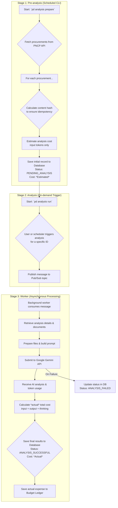

<!-- omit in toc -->
# 🕵️ Contributing to Public Detective

<div align="center">
  
</div>

First off, thank you for considering contributing to Public Detective! It's people like you that make the open-source community such an amazing place. We love to receive contributions from our community — you!

Public Detective is a civic tech project that aims to bring more transparency to public procurement in Brazil. Your help is essential to making this tool more effective and impactful. By contributing, you're helping to build a more accountable government.

This document is your one-stop guide to contributing to the project. Let's get started!

<!-- omit in toc -->
## Table of Contents
- [How Can I Contribute?](#how-can-i-contribute)
  - [🐛 Reporting Bugs](#-reporting-bugs)
  - [💡 Suggesting Enhancements](#-suggesting-enhancements)
  - [📖 Improving Documentation](#-improving-documentation)
  - [💻 Writing Code](#-writing-code)
- [Your First Code Contribution](#your-first-code-contribution)
  - [1. Fork the Repository](#1-fork-the-repository)
  - [2. Create a Branch](#2-create-a-branch)
  - [3. Set Up Your Dev Lair (Environment)](#3-set-up-your-dev-lair-environment)
  - [4. Make Your Changes](#4-make-your-changes)
  - [5. Commit Your Changes](#5-commit-your-changes)
  - [6. Push to Your Branch](#6-push-to-your-branch)
  - [7. Open a Pull Request](#7-open-a-pull-request)
- [The Detective's Toolkit (Style Guides)](#the-detectives-toolkit-style-guides)
  - [Python Code](#python-code)
  - [Git Commit Messages](#git-commit-messages)
- [🤓 Workflow Overview](#-workflow-overview)
- [Code of Conduct](#code-of-conduct)
- [Thank You!](#thank-you)

## How Can I Contribute?

There are many ways to contribute, and many of them don't involve writing a single line of code.

### 🐛 Reporting Bugs
If you find a bug—something isn't working as expected—please [open a bug report issue](https://github.com/hunsche/public-detective/issues/new?template=bug_report.md). Be sure to include as much detail as possible, including steps to reproduce the bug, the expected outcome, and the actual outcome.

<div align="center">
  
</div>

### 💡 Suggesting Enhancements
Have an idea for a new feature or an improvement to an existing one? We'd love to hear it. [Open a feature request issue](https://github.com/hunsche/public-detective/issues/new?template=feature_request.md) to start the discussion. This is a great way to contribute your ideas and domain expertise.

### 📖 Improving Documentation
Good documentation is key to a successful open-source project. If you find typos, unclear sentences, or areas in the `README.md` or other documents that could be improved, please don't hesitate to open an issue or submit a pull request with your suggested changes.

### 💻 Writing Code
If you're ready to jump into the code, we're excited to have you. You can help by:
- Picking up an existing issue labeled `help wanted` or `good first issue`.
- Implementing a new feature you've discussed with the team.
- Adding or improving tests.

## Your First Code Contribution

Ready to submit code? Here’s our workflow. It’s as easy as 1-2-3-4-5-6-7!

### 1. Fork the Repository
Fork the project to your own GitHub account by clicking the "Fork" button at the top right of the main repository page.

<div align="center">
  
</div>

### 2. Create a Branch
Create a new branch from `main` in your fork for your feature or bug fix. Use a descriptive name.
```sh
git checkout -b feature/my-new-amazing-feature
```

<div align="center">
  
</div>

### 3. Set Up Your Dev Lair (Environment)
Make sure your development environment is set up by following the instructions in the `README.md`.

```sh
# Install dependencies
poetry install
```

### 4. Make Your Changes
Implement your feature or fix the bug. Make sure your code is clean, and follows the project's style.

<div align="center">
  
</div>

### 5. Commit Your Changes
Commit your changes with a clear and descriptive commit message. We follow the [Conventional Commits](https://www.conventionalcommits.org/en/v1.0.0/) specification.

```sh
# Example of a commit message
git commit -m "feat: Add new detector for overly restrictive deadlines"
```

Common prefixes include:

  - `feat`: A new feature
  - `fix`: A bug fix
  - `docs`: Documentation only changes
  - `style`: Changes that do not affect the meaning of the code (white-space, formatting, etc.)
  - `refactor`: A code change that neither fixes a bug nor adds a feature
  - `test`: Adding missing tests or correcting existing tests

### 6. Push to Your Branch
Push your new branch to your forked repository.

```sh
git push origin feature/my-new-amazing-feature
```

### 7. Open a Pull Request
Go to the `hunsche/public-detective` repository on GitHub and open a new Pull Request.

- Make sure your PR is against the `main` branch of the original repository.
- Provide a clear title and a detailed description of your changes. Explain *what* you changed and *why*.
- If your PR addresses an open issue, link to it in the description (e.g., `Fixes #123`).

Once your PR is open, a project maintainer will review it. We may ask for changes, but we'll work with you to get your contribution merged. We appreciate your effort!

<div align="center">
  
</div>

## The Detective's Toolkit (Style Guides)

### Python Code
This project uses [`pre-commit`](https://pre-commit.com/) to automatically manage code formatting and quality checks. The configuration is defined in the `.pre-commit-config.yaml` file at the root of the project.

After you run `pre-commit install` once, these hooks will be active. Now, every time you run `git commit`, `pre-commit` will automatically run tools like:

  - **[Black](https://github.com/psf/black):** for consistent code formatting.
  - **[Flake8](https://flake8.pycqa.org/en/latest/):** for identifying programming errors and style violations.
  - **[isort](https://pycqa.github.io/isort/):** for automatically sorting imports.

If any of these checks fail, your commit will be aborted. Simply review the error messages (some tools like Black will fix the files for you automatically), `git add` the changes, and try to commit again. This process ensures that all code committed to the repository maintains a high standard of quality and a consistent style.

### Git Commit Messages
As mentioned above, we use the [Conventional Commits](https://www.conventionalcommits.org/en/v1.0.0/) standard. This helps us automate changelogs and makes the project history more readable.

## 🤓 Workflow Overview
The application operates in a multi-stage pipeline: a lightweight **Pre-analysis** stage to discover and prepare data, an on-demand trigger for the **Analysis** stage, and an asynchronous **Worker** to handle the AI processing. This decoupled architecture ensures efficiency and cost-effectiveness.

The diagram below illustrates the complete workflow:



## Code of Conduct
We are committed to providing a friendly, safe and welcoming environment for all, regardless of gender, sexual orientation, disability, ethnicity, religion, or similar personal characteristic. Please read our [Code of Conduct](./CODE_OF_CONDUCT.md) to learn more.

## Thank You!
Thank you again for your interest in contributing to **Public Detective**!

<div align="center">
  
</div>
