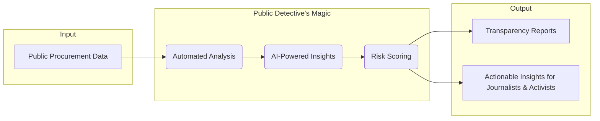

# ✨ Public Detective ✨

<div align="center">
  
</div>

<div align="center">

> An AI-powered tool for enhancing transparency and accountability in Brazilian public procurement.

</div>

<div align="center">

🚀 **[See the live platform!](https://detetive-publico.com)** 🚀

</div>

[](https://github.com/hunsche/public-detective/actions/workflows/ci.yml)

[](https://creativecommons.org/licenses/by-nc/4.0/)
[](https://www.python.org/downloads/release/python-3120/)
[](https://github.com/psf/black)


## 🕵️‍♂️ What's This All About?

Ever feel like public spending is a black box? In Brazil, billions are spent on public contracts, but keeping an eye on all of it is a Herculean task. Mistakes, inefficiencies, and even fraud can hide in mountains of documents.

**Public Detective** is here to change the game. We're an AI-powered watchdog that sniffs out irregularities in public tenders. Think of it as a digital detective, working 24/7 to help journalists, activists, and you demand transparency.

This isn't just code; it's a mission. Developed at **PUCPR** with the help of the amazing folks at **Transparência Brasil**, this project puts cutting-edge tech in the hands of the people.

## 🌟 Core Features

- **🤖 Automated Data Retrieval:** Fetches procurement data directly from the official PNCP APIs.
- **💡 AI-Powered Analysis:** Uses a Generative AI model to flag potential red flags and provide a detailed risk score with a rationale.
- **🗃️ Full Traceability:** Archives both original and processed documents in Google Cloud Storage for every analysis.
- **🛡️ Idempotent by Design:** Avoids re-analyzing unchanged documents by checking a content hash.

## ⚙️ How the Magic Happens

The application operates in a two-stage pipeline: a lightweight **Pre-analysis** stage to discover and prepare data, followed by an on-demand, AI-powered **Analysis** stage. This decoupled architecture ensures efficiency and cost-effectiveness.

Here’s a simplified look at how it works:



## 🛠️ Built With

- **Language:** Python 3.12+
- **AI / NLP:** Google Gemini API
- **Database:** PostgreSQL
- **Infrastructure:** Docker, Google Cloud Storage, Google Cloud Pub/Sub

## 🏁 Get Started

To get a local copy up and running, follow these simple steps.

### Prerequisites

- **Python 3.12+**
- **Poetry** for dependency management
- **Docker** and **Docker Compose** for running services

### Installation & Setup

1.  **Clone the repo:**
    ```sh
    git clone https://github.com/hunsche/public-detective.git
    cd public-detective
    ```
2.  **Install dependencies:**
    ```sh
    poetry install
    ```
3.  **Set up environment variables:**
    Create a `.env` file and add your Gemini API key.
    ```sh
    echo "GCP_GEMINI_API_KEY='YOUR_API_KEY'" > .env
    ```
4.  **Start services:**
    ```bash
    docker compose up -d
    ```
5.  **Run database migrations:**
    ```bash
    poetry run alembic upgrade head
    ```

## 💻 How to Use

The application is controlled via a Command-Line Interface (CLI) with two main commands.

### `pre-analyze`
This command runs the first stage of the pipeline, fetching new procurement data and preparing it for analysis.

**Example 1: Run for a specific date range**
```bash
$ poetry run python -m source.cli pre-analyze --start-date 2025-01-01 --end-date 2025-01-05

INFO: Starting pre-analysis for dates: 2025-01-01 to 2025-01-05...
INFO: Fetching data from PNCP...
INFO: Found 5 new procurements.
INFO: Pre-analysis complete. 5 items are now pending full analysis.
```

**Example 2: Run for the current day (default)**
```bash
$ poetry run python -m source.cli pre-analyze

INFO: Starting pre-analysis for date: 2025-08-31...
INFO: Fetching data from PNCP...
INFO: Found 2 new procurements.
INFO: Pre-analysis complete. 2 items are now pending full analysis.
```

---
### `analyze`
This command triggers the full, AI-powered analysis for a specific item that has been pre-analyzed.

**Example: Trigger the analysis for a specific ID**
```bash
$ poetry run python -m source.cli analyze --analysis-id 123

INFO: Triggering analysis for ID: 123...
INFO: Message published successfully. A background worker will process the analysis shortly.
```

## 🙌 Join the Mission!

Contributions are what make the open-source community such an amazing place to learn, inspire, and create. Any contributions you make are **greatly appreciated**. Please refer to the `CONTRIBUTING.md` file for details.

## 📄 License

Distributed under the Creative Commons Attribution-NonCommercial 4.0 International License. See `LICENSE` for more information.

## 📬 Get In Touch

<div align="center">
<table>
  <tr>
    <td valign="top">
      <a href="https://github.com/hunsche"></a>
    </td>
    <td valign="top">
      <b>Matheus Hunsche</b>
      <br />
      <a href="https://www.linkedin.com/in/matheus-aoki-hunsche-085446107/"></a>
      <br />
      <a href="mailto:mthunsche+public-detective@gmail.com"></a>
    </td>
  </tr>
</table>
</div>
