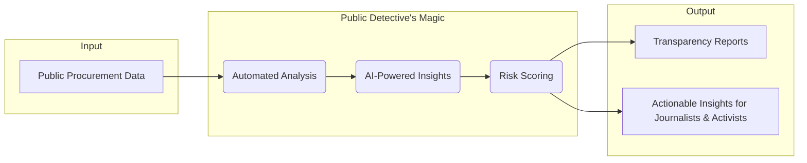

# ✨ Public Detective ✨

<div align="center">

[](https://github.com/hunsche/public-detective/actions/workflows/ci.yml)


[](https://creativecommons.org/licenses/by-nc/4.0/)
[](https://www.python.org/downloads/release/python-3120/)
[](https://python-poetry.org/)
[](https://github.com/psf/black)
[](https://github.com/pre-commit/pre-commit)
[](http://mypy-lang.org/)
[](https://flake8.pycqa.org/en/latest/)
[](https://github.com/PyCQA/bandit)
[](https://pycqa.github.io/isort/)
[](https://github.com/jendrikseipp/vulture)
[](https://alembic.sqlalchemy.org/)
[](https://click.palletsprojects.com/)

</div>

<div align="center">
  
</div>

<div align="center">

> An AI-powered tool for enhancing transparency and accountability in Brazilian public procurement.

</div>

<div align="center">

🚀 **[See the live platform!](https://detetive-publico.com)** 🚀

</div>

## 🕵️‍♂️ What's This All About?

Ever feel like public spending is a black box? In Brazil, billions are spent on public contracts, but keeping an eye on all of it is a Herculean task. Mistakes, inefficiencies, and even fraud can hide in mountains of documents.

**Public Detective** is here to change the game. We're an AI-powered watchdog that sniffs out irregularities in public tenders. Think of it as a digital detective, working 24/7 to help journalists, activists, and you demand transparency.

This isn't just code; it's a mission. Developed at **PUCPR** with the help of the amazing folks at **Transparência Brasil**, this project puts cutting-edge tech in the hands of the people.

## 🌟 Core Features

- **🤖 Automated Data Retrieval:** Fetches procurement data directly from the official PNCP APIs.
- **💡 AI-Powered Analysis:** Uses a Generative AI model to flag potential red flags and provide a detailed risk score with a rationale.
- **🗃️ Full Traceability:** Archives both original and processed documents in Google Cloud Storage for every analysis.
- **🛡️ Idempotent by Design:** Avoids re-analyzing unchanged documents by checking a content hash.

## ⚙️ How the Magic Happens

The application operates in a two-stage pipeline: a lightweight **Pre-analysis** stage to discover and prepare data, followed by an on-demand, AI-powered **Analysis** stage. This decoupled architecture ensures efficiency and cost-effectiveness.

Here’s a simplified look at how it works:



## 🛠️ Built With

- **Language:** Python 3.12+
- **AI / NLP:** Google Gemini API
- **CLI Framework:** Click
- **Database & Migrations:** PostgreSQL, managed with Alembic
- **Core Toolkit:**
  - **SQLAlchemy Core:** For writing safe, raw SQL queries.
  - **Tenacity:** To provide automatic retries for resilient operations.
  - **Textract:** For extracting content from various document formats.
- **Infrastructure:** Docker, Google Cloud Storage, Google Cloud Pub/Sub

## 🏁 Get Started

To get a local copy up and running, follow these simple steps.

### Prerequisites

-   Python 3.12
-   Poetry
-   Docker
-   **`antiword`**: Required by the `textract` library to extract text from legacy `.doc` files.

### ⚙️ Installation

1.  **Clone the repository:**
    ```sh
    git clone https://github.com/hunsche/public-detective.git
    cd public-detective
    ```
2.  **Install dependencies:**
    ```bash
    poetry install
    ```
3.  **Set up environment variables:**
    Create a `.env` file from the example. This is primarily used to configure local emulators.
    ```sh
    cp .env.example .env
    ```
    Authentication with Google Cloud is handled automatically. See the
    [Authentication](#-authentication) section for more details.

4.  **Start services:**
    ```bash
    docker compose up -d
    ```
5.  **Apply database migrations:**
    ```bash
    poetry run alembic upgrade head
    ```

## 🔐 Authentication

This project uses the **Vertex AI** backend for the Google Gemini API and authenticates using a standard Google Cloud pattern called [Application Default Credentials (ADC)](https://cloud.google.com/docs/authentication/application-default-credentials). This provides a secure and flexible mechanism that works across different environments.

The application attempts to find credentials in the following order:

1.  **`GOOGLE_APPLICATION_CREDENTIALS` Environment Variable:**
    -   **Use Case:** This is the standard Google Cloud method to force the application to use a specific service account. It's useful for local development or CI/CD.
    -   **To Use:** Set the environment variable to the **absolute path** of your service account's JSON key file.
    -   **⭐ E2E Test Convention:** To make running E2E tests easier, this project uses the `GCP_SERVICE_ACCOUNT_CREDENTIALS` variable (defined in `.env.example`). You should paste the **full JSON content** of your key there. The test suite will automatically handle creating a temporary file and setting the `GOOGLE_APPLICATION_CREDENTIALS` path for you during the test run.

2.  **`gcloud` CLI Credentials (for Local Development):**
    -   **Use Case:** The most common method for local development.
    -   **To Use:** If the `GCP_SERVICE_ACCOUNT_CREDENTIALS` variable is not set, the application will use the credentials of the user logged into the `gcloud` CLI. To set this up, run:
        ```sh
        gcloud auth application-default login
        ```

3.  **Attached Service Account (Recommended for Production on GCP):**
    -   **Use Case:** When running the application on Google Cloud infrastructure (e.g., Cloud Run, GKE, Compute Engine).
    -   **How it Works:** The application automatically detects and uses the service account attached to the host resource. This is the most secure method for production as it eliminates the need to manage and store credential files.
    -   **To Use:** Ensure the `GCP_SERVICE_ACCOUNT_CREDENTIALS` environment variable is **unset**, and the host's service account has the necessary IAM permissions (e.g., "Vertex AI User"). Also, ensure any emulator-specific environment variables (like `GCP_GEMINI_HOST`) are cleared so the application connects to the live Google Cloud APIs.

## 💻 How to Use

The application is controlled via a Command-Line Interface (CLI) with two main commands.

### `pre-analyze`
This command runs the first stage of the pipeline, fetching new procurement data and preparing it for analysis.

**Example 1: Run for a specific date range**
```bash
$ poetry run python -m source.cli pre-analyze --start-date 2025-01-01 --end-date 2025-01-05

INFO: Starting pre-analysis for dates: 2025-01-01 to 2025-01-05...
INFO: Fetching data from PNCP...
INFO: Found 5 new procurements.
INFO: Pre-analysis complete. 5 items are now pending full analysis.
```

**Example 2: Run for the current day (default)**
```bash
$ poetry run python -m source.cli pre-analyze

INFO: Starting pre-analysis for date: 2025-08-31...
INFO: Fetching data from PNCP...
INFO: Found 2 new procurements.
INFO: Pre-analysis complete. 2 items are now pending full analysis.
```

---
### `analyze`
This command triggers the full, AI-powered analysis for a specific item that has been pre-analyzed.

**Example: Trigger the analysis for a specific ID**
```bash
$ poetry run python -m source.cli analyze --analysis-id 123

INFO: Triggering analysis for ID: 123...
INFO: Message published successfully. A background worker will process the analysis shortly.
```

---
### `reap-stale-tasks`
This is a maintenance command to clean up "orphan" tasks. If a worker crashes mid-process, a task could be stuck in the `IN_PROGRESS` state indefinitely. This command finds such tasks and resets them to `TIMEOUT`, allowing them to be re-processed.

**Example: Reset tasks that have been in-progress for more than 15 minutes (default)**
```bash
$ poetry run python -m source.cli reap-stale-tasks

INFO: Searching for stale tasks with a timeout of 15 minutes...
INFO: Successfully reset 1 stale task to TIMEOUT status.
```

**Example: Use a custom 60-minute timeout**
```bash
$ poetry run python -m source.cli reap-stale-tasks --timeout-minutes 60

INFO: Searching for stale tasks with a timeout of 60 minutes...
INFO: No stale tasks found.
```

## 🙌 Join the Mission!

Contributions are what make the open-source community such an amazing place to learn, inspire, and create. Any contributions you make are **greatly appreciated**. Please refer to the `CONTRIBUTING.md` file for details.

## 📄 License

Distributed under the Creative Commons Attribution-NonCommercial 4.0 International License. See `LICENSE` for more information.

## 📬 Get In Touch

<div align="center">
<table>
  <tr>
    <td valign="top">
      <a href="https://github.com/hunsche"></a>
    </td>
    <td valign="top">
      <b>Matheus Aoki Hunsche</b>
      <br />
      <a href="https://www.linkedin.com/in/matheus-aoki-hunsche-085446107/"></a>
      <br />
      <a href="mailto:mthunsche+public-detective@gmail.com"></a>
    </td>
  </tr>
</table>
</div>
