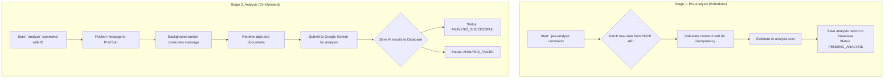

# 🔎 Public Detective

[](https://github.com/hunsche/public-detective/actions/workflows/ci.yml)

[](https://creativecommons.org/licenses/by-nc/4.0/)
[](https://www.python.org/downloads/release/python-3120/)
[](https://github.com/psf/black)

> An AI-powered tool for enhancing transparency and accountability in Brazilian public procurement.

## About The Project

Public procurement in Brazil is a multi-billion dollar enterprise, but its complexity can make it opaque and vulnerable to inefficiencies, fraud, and corruption. **Public Detective** is an academic project designed to address this challenge by leveraging modern technology for social good.

This tool automatically fetches public tender data from Brazil's National Public Procurement Portal (PNCP) and uses Artificial Intelligence to analyze the full text of bid documents. The primary goal is to identify and flag potential irregularities, making it easier for journalists, civil society organizations, and citizens to scrutinize public spending.

This is a research and extension project developed at the **Pontifical Catholic University of Paraná (PUCPR)**, and it benefits from the valuable feedback and expertise of the NGO **Transparência Brasil**.

## ✨ Key Features

- **Automated Data Retrieval:** Fetches procurement data directly from the official PNCP APIs.
- **AI-Powered Irregularity Detection:** Uses a Generative AI model to flag potential red flags and provide a detailed risk score with a rationale.
- **Traceability:** Archives both original and processed documents in Google Cloud Storage for every analysis.
- **Idempotency:** Avoids re-analyzing unchanged documents by checking a content hash.

## 🚀 How It Works

The application operates in a two-stage pipeline: a lightweight **Pre-analysis** stage to discover and prepare data, followed by an on-demand, AI-powered **Analysis** stage. This decoupled architecture ensures efficiency and cost-effectiveness.

The diagram below illustrates the complete workflow:



## 🛠️ Tech Stack

- **Language:** Python 3.12+
- **AI / NLP:** Google Gemini API
- **Database:** PostgreSQL with Psycopg2
- **Infrastructure:** Docker, Google Cloud Storage, Google Cloud Pub/Sub

## 🏁 Getting Started

To get a local copy up and running, follow these simple steps.

### Prerequisites

- **Python 3.12+**
- **Poetry** for dependency management
- **Docker** and **Docker Compose** for running services

### Installation & Setup

1.  **Clone the repo:**
    ```sh
    git clone https://github.com/hunsche/public-detective.git
    cd public-detective
    ```
2.  **Install dependencies:**
    ```sh
    poetry install
    ```
3.  **Set up environment variables:**
    Create a `.env` file and add your Gemini API key.
    ```sh
    echo "GCP_GEMINI_API_KEY='YOUR_API_KEY'" > .env
    ```
4.  **Start services:**
    ```bash
    docker compose up -d
    ```
5.  **Run database migrations:**
    ```bash
    poetry run alembic upgrade head
    ```

## 💻 Usage

The application is controlled via a Command-Line Interface (CLI) with two main commands.

### `pre-analyze`
This command runs the first stage of the pipeline, fetching new procurement data and preparing it for analysis.

**Example 1: Run for a specific date range**
```bash
# ~/Projects/public-detective on main
$ poetry run python -m source.cli pre-analyze --start-date 2025-01-01 --end-date 2025-01-05

INFO: Starting pre-analysis for dates: 2025-01-01 to 2025-01-05...
INFO: Fetching data from PNCP...
INFO: Found 5 new procurements.
INFO: Pre-analysis complete. 5 items are now pending full analysis.
```

**Example 2: Run for the current day (default)**
```bash
# ~/Projects/public-detective on main
$ poetry run python -m source.cli pre-analyze

INFO: Starting pre-analysis for date: 2025-08-31...
INFO: Fetching data from PNCP...
INFO: Found 2 new procurements.
INFO: Pre-analysis complete. 2 items are now pending full analysis.
```

---
### `analyze`
This command triggers the full, AI-powered analysis for a specific item that has been pre-analyzed.

**Example: Trigger the analysis for a specific ID**
```bash
# ~/Projects/public-detective on main
$ poetry run python -m source.cli analyze --analysis-id 123

INFO: Triggering analysis for ID: 123...
INFO: Message published successfully. A background worker will process the analysis shortly.
```

## 🙌 Contributing

Contributions are what make the open-source community such an amazing place to learn, inspire, and create. Any contributions you make are **greatly appreciated**. Please refer to the `CONTRIBUTING.md` file for details.

## 📄 License

Distributed under the Creative Commons Attribution-NonCommercial 4.0 International License. See `LICENSE` for more information.

## 📬 Contact

Matheus Hunsche - [LinkedIn](https://www.linkedin.com/in/matheus-aoki-hunsche-085446107/) - mthunsche+public-detective@gmail.com

Project Link: [https://detetive-publico.com](https://detetive-publico.com)
